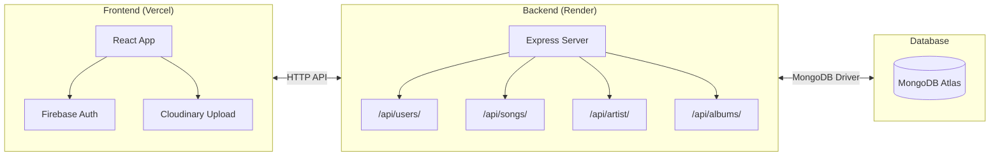

# 🎵 Musicflew

A full-stack music streaming web application built with React, Node.js, MongoDB, Firebase Authentication, and Cloudinary.

> **Live demo:** [musicflew.vercel.app](https://musicflew.vercel.app) &nbsp;·&nbsp; **Source:** [github.com/shopatomek/musicflew](https://github.com/shopatomek/musicflew)

---

## ✨ Features

- **Google Sign-In** via Firebase Authentication
- **Role-based access control** — Member / Admin roles with admin dashboard
- **Music player** — full playback controls, track navigation, album art with logo fallback
- **File uploads** — audio and cover images stored in Cloudinary (unsigned upload preset)
- **CRUD operations** — create, edit, delete songs / artists / albums
- **Filtering** — filter songs by language, artist, album, category
- **Persistent sidebar** — live song library visible across all dashboard views
- **Global search** — search bar in nav filters the sidebar song list in real time
- **Animated UI** — smooth page transitions with Framer Motion

---

## 🛠️ Tech Stack

| Layer    | Technology                                             |
| -------- | ------------------------------------------------------ |
| Frontend | React 18, React Router v6, Tailwind CSS, Framer Motion |
| Backend  | Node.js, Express                                       |
| Database | MongoDB Atlas (Mongoose ODM)                           |
| Auth     | Firebase Authentication (Google Sign-In)               |
| Storage  | Cloudinary (replaces Firebase Storage)                 |
| Hosting  | Vercel (frontend) + Render (backend)                   |

---

## 🏗️ Architecture



---

## 🚀 Local Development

### Prerequisites

- Node.js 16+
- MongoDB Atlas account
- Firebase project (Authentication enabled)
- Cloudinary account (free tier)

### 1. Clone

```bash
git clone https://github.com/shopatomek/musicflew.git
cd musicflew
```

### 2. Environment variables

```bash
cp .env.example client/.env
cp .env.example server/.env
```

Fill in your credentials — see `.env.example` for all required keys.

### 3. Install & run

```bash
# Terminal 1 — backend
cd server && npm install && npm run dev

# Terminal 2 — frontend
cd client && npm install && npm start
```

App available at `http://localhost:3000`

---

## 🔒 Environment Variables

### Client (`client/.env`)

| Variable                             | Description                                 |
| ------------------------------------ | ------------------------------------------- |
| `REACT_APP_API_URL`                  | Backend URL (e.g. `http://localhost:4000/`) |
| `REACT_APP_FIREBASE_API_KEY`         | Firebase web API key                        |
| `REACT_APP_FIREBASE_AUTH_DOMAIN`     | Firebase auth domain                        |
| `REACT_APP_FIREBASE_PROJECT_ID`      | Firebase project ID                         |
| `REACT_APP_FIREBASE_MESSAGING_ID`    | Firebase messaging sender ID                |
| `REACT_APP_FIREBASE_APP_ID`          | Firebase app ID                             |
| `REACT_APP_CLOUDINARY_CLOUD_NAME`    | Cloudinary cloud name                       |
| `REACT_APP_CLOUDINARY_UPLOAD_PRESET` | Cloudinary unsigned upload preset name      |

> `REACT_APP_FIREBASE_STORAGE_BUCKET` is no longer required — storage was migrated to Cloudinary.

### Server (`server/.env`)

| Variable                   | Description                     |
| -------------------------- | ------------------------------- |
| `DB_STRING`                | MongoDB Atlas connection string |
| `CORS_ORIGIN`              | Frontend URL for CORS           |
| `FIREBASE_PROJECT_ID`      | Firebase project ID             |
| `FIREBASE_PRIVATE_KEY`     | Firebase Admin SDK private key  |
| `FIREBASE_CLIENT_EMAIL`    | Firebase Admin SDK client email |
| `FIREBASE_PRIVATE_KEY_ID`  | Firebase private key ID         |
| `FIREBASE_CLIENT_ID`       | Firebase client ID              |
| `FIREBASE_CLIENT_CERT_URL` | Firebase cert URL               |

---

## 📁 Project Structure

```
musicflew/
├── client/                   # React frontend
│   ├── src/
│   │   ├── api/              # Axios API calls
│   │   ├── assets/img/       # Static assets (logo, favicon)
│   │   ├── components/       # React components
│   │   ├── config/           # Firebase client config (Auth only)
│   │   ├── context/          # Global state (useReducer)
│   │   └── utils/            # Helper functions
│   └── vercel.json           # Vercel SPA routing config
└── server/                   # Express backend
    ├── config/               # Firebase Admin SDK config
    ├── models/               # Mongoose schemas
    └── routes/               # REST API routes
```

---

## 🎨 UI Overview

- **Login page** — glassmorphism Google sign-in button on full-screen background
- **Dashboard nav** — persistent top bar with Create dropdown (Song / Artist / Album), global search, and page links
- **Sidebar** — always-visible song library that filters in real time with the search bar
- **Create page (`/newSongs`)** — tabbed form (Song / Artist / Album) with Cloudinary file upload and progress bar; all image/audio fields are optional
- **Song cards** — display cover art with logo fallback when no image is set

---

## 👤 Author

**Tomasz Szopa**
&nbsp;·&nbsp; [shopa.tomek@gmail.com](mailto:shopa.tomek@gmail.com)
&nbsp;·&nbsp; [GitHub](https://github.com/shopatomek)
