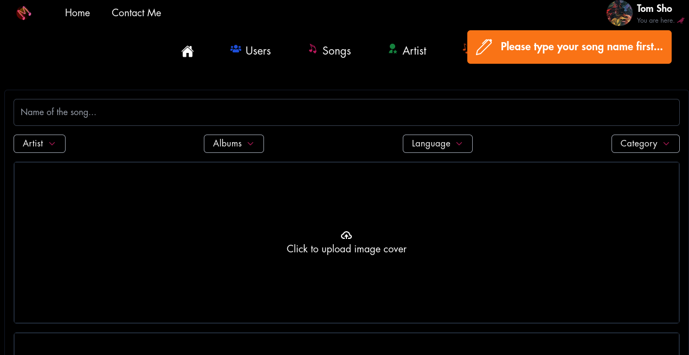

<div align="center">
    <h1><strong>Musicflew<strong></strong></h1>
</div>

<p>
Fullstack application based on React and Node.js that creates artists, plays and creates songs and albums. 
By <b>default</b>, new User is set to be a <b>"Member"</b> after successfully logging into a Gmail account. Admin has the option to change the role of new User to "Admin" after a status change request has been made. When the new role is set User has the same management tools as Admin.

<b>Admin can change the roles of other Admins and Members</b> and can <b>remove</b> them from the database completely although after being accidentally deleted, they can be restored to their roles easily by successfully logging into the Gmail account again.

Click on Song's when You want to search or filter songs. Click Plus button to create a new song or an Artist or Album by uploading audio and images.
Click on Contact to contact me. Feel free to ask !

<h4>Please read the instructions below to configure and install the App before download the repository</h4>

<b>If some problem occurs please feel free to contact me. </b>
Please be aware that the Musicflew is still being improved and waiting for deployment. New functionalites will be added in the future

<h3>Enjoy the fun !</h3>
<br>

<hr>



<p>

<br>
<hr<>

<div align="center">
<h1>Dependencies and installation</h1>
    <h4><strong>React and Node.js<strong></strong></h4>
</div>

### 1. Before using the app please follow commands:

Type this code below in the bash console to clone repository in the desired place in your computer

```bash
    git clone https://gitlab.com/shopa.tomek/musicflew.git
```

Due to app is based on both React and Node.js it's essential to install all necessary depenencies
for the client and server folder separately

### 2. Go to the cloned **musicflew** project folder and then:

### For React:

```bash
    cd client
```

and now install all dependencies

```bash
    npm install
```

### For Node

```bash
    cd server
```

and now install all dependencies

```bash
    npm install
```

<hr>
<div align="center">
    <h1><strong>Start the app:<strong></strong></h1>
</div>
<hr>

<p>After installation of the all necessary dependencies (like node modules) is done, You can run app typing: <p>

### REACT SERVER

<hr>
<hr>

### In client folder

```bash
    npm run start
```

It will automatically redirect React localhost at port 3000 server to the default browser.
Otherwise plesase type:
**http://localhost:3000** in the browser

<hr>

### NODE.JS SERVER

<hr>
<hr>

### In server folder

```bash
    npm run dev
```

When Node.js server is launched you will receive screen like this below in the console. It means that data base services are ready to work on back-end site
Node.js server is default set at the port 4000.

```bash
    > server@1.0.0 dev
    > nodemon app.js

[nodemon] 2.0.20
[nodemon] to restart at any time, enter `rs`
[nodemon] watching path(s): *.*
[nodemon] watching extensions: js,mjs,json
[nodemon] starting `node app.js`
link here: http://localhost:4000
Connected
```

<hr>

###

**All functionality of the Musicflew is now under http://localhost:3000**

### ENJOY !!
